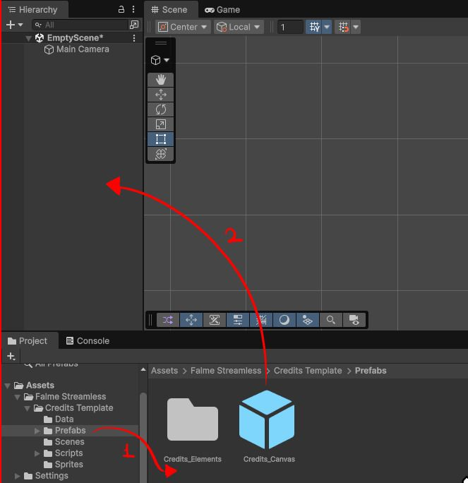
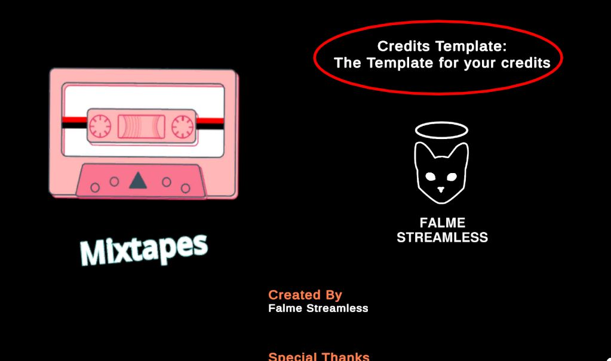
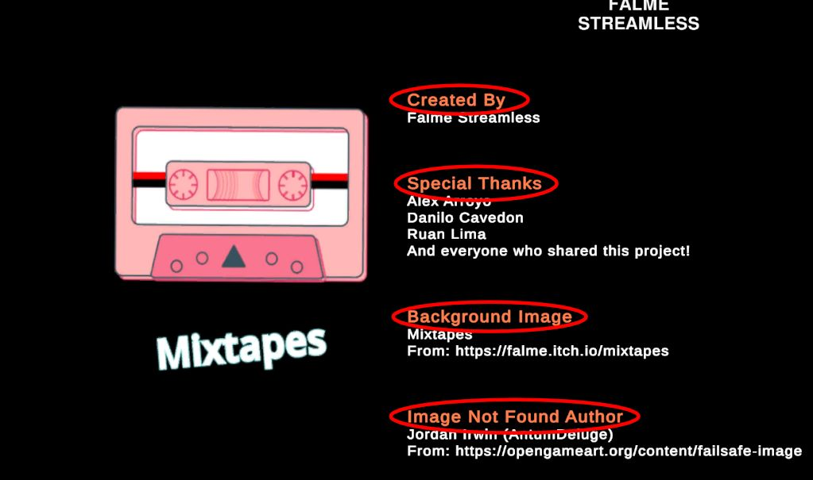
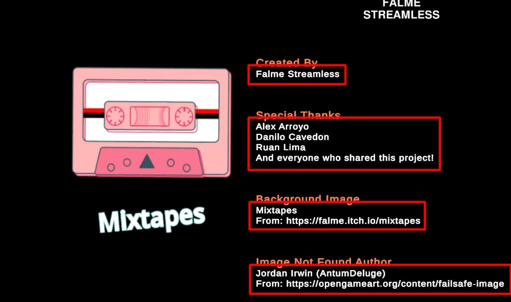
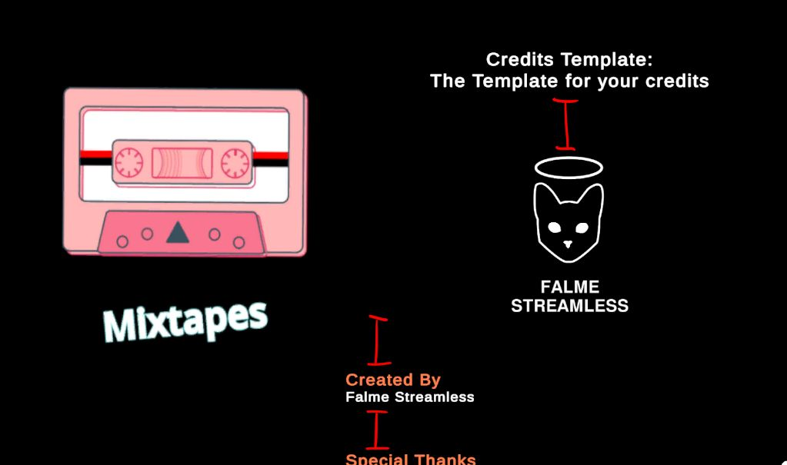
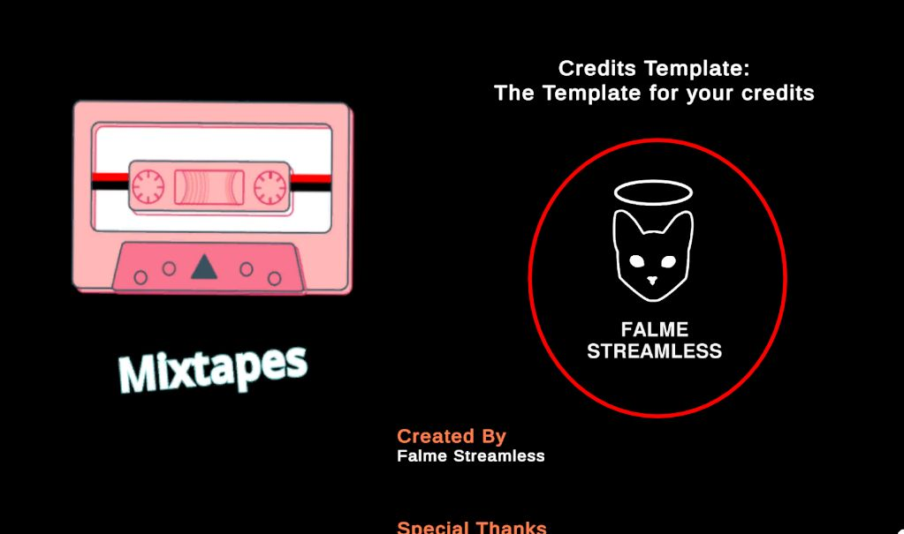

# Credits Template (Unity Edition) : Documentation

## Installation

1. Download the Credits Template Package
	- [GitHub Releases Page](https://github.com/Falme/credits-template-unity/releases)
2. Add to your Unity Project
	- Go to `Assets > Import Package > Custom Package` and select the `Credits-Unity-x-x-x.unitypackage` file.
3. Install the Dependencies
	- Install Text Mesh Pro
		- Go to `Window > TextMeshPro > Import TMP Essential Resources` and wait to finish importing
	- Install Newtonsoft.JSON
		- Go to `Window > Package Management > Package Manager` to open Package Manager
		- Click the Plus Sign `+ > Install package by name...`
		- Write the Newtonsoft address in the name field: `com.unity.nuget.newtonsoft-json` and wait to finish importing
4. Drag and Drop the prefab at `Credits_Template/prefabs/Credits_Canvas.prefab` to your scene or into a predefined Canvas
	- 

## Configurations

All the configurations is predefined into the prefab OR can be modified in the JSON data found at `Credits_Template/Data/credits.json`.

The JSON file can configure quickly your information inside the credits and the velocity of it.
The Prefabs can configure the visuals of your credits scene, changing fonts, size, colors and etc.

### JSON Data

I suggest that you check how is the currently `credits.json` file and follow that structure, you are not limited to it, but I truly recommend that.

The basic structure is:

```json
{
	"version" : "x.x.x",
	"velocity" : 100,
	"items" : [ Array of items objects ]
}
```

Items is an object that have a type and predefined values, here's the structure for each one:

#### Title

The type `title` is a label of text, usually used as a title of the credits and/or the name of the game:

```json
{
	"type": "title",
	"text": "The name of your game \nThe Next line of the same title"
}
```



This looks like it's unique and should not be repeated, but that's not true, you can repeat this object many times you want.

#### Category

The type `category` is a label of text for the roles of the team, usually a header before the names that worked at that role.

```json
{
	"type": "category",
	"text": "The role of those who worked in the game (such as Producer, QA, etc)"
}
```



#### Actors

The type `actors` is a label of text for the names of the people who worked in the project. This item have an Array for the names for you to input.

```json
{
	"type": "actor",
	"actors": [
		"First Person Name",
		"Second Person Name",
		"Other Person Name",
		"And Another Person Name"
	]
}
```



I've checked some examples and there's some credits that is just a wall of names, for performance sake do not put every single name into the actors array, try to separate it in chunks. There's no recommended number like 5, 10 or 25. Usually this space is defined by the UI screen size, if your game have small or big resolution, adequate the chunks based on what looks best on screen.

If you have no idea, 10 is a number that I use normally.

#### Space

The type `space` is an interface element that has a specific height. This is used to separate items one from another for better interface disposition.

```json
{
	"type": "space",
	"height": 100.0
}
```



#### Image

The type `image` is a Texture in the interface that loads an image from the folder `StreamingAssets`. You must define a height for the image, just like the item `space`.

```json
{
	"type": "image", 
	"path": "FolderNameInStreamingAssets/image_you_want_to_load.png", 
	"height": 300
}
```



The image is being loaded on the runtime directly to the memory, so be mindful that big images or too many images could affect the performance.

With that, we covered all the possible items in the current version.

## Creating Your Own Item

If this is not sufficient for your needs, you could create your own item.

### 1. Creating the Prefab

First of all, you will need to create a new interface gameobject, the way you will do it does not matter, but I recommend that you add a `LayoutElement` component to it.

Every item will be placed inside a GameObject called `Credits_Staff` and it contains the `VerticalLayoutGroup` component, making it show the items sequentially, like a list.

After creating the visuals for your item, we need to add the Script.

### 2. Creating the Script

The script that you will create MUST inherit from `CreditsItem`. This script have the necessary to connect and manage itself with the Pooling System. So, the basics of the new script should be something like:

```cs
using UnityEngine;

namespace FalmeStreamless.Credits
{
	public class YourNewItem : CreditsItem
	{
		protected override void Awake()
		{
			base.Awake();
		}

		public override void Initialize(CreditsItemData data)
		{
		}
	}
}
```

The method `Initialize(CreditsItemData data)` is called from the pooling system, and this is how you call the information of your item from JSON.

### 3. Adding Your Prefab to the List


## Known Problems/Errors/Bugs

- The Signature of Newtonsoft.JSON is not valid
	- The only way to solve this is upgrading your Unity3D version. I've had this problem with the version 6.3.2f1, and upgrading to 6.3.6f1 solved the signatures.

## Found a Bug or have a Feedback?

I do not have a proper place for that, for informal conversation reach me at my [Bluesky](https://bsky.app/profile/falme.com.br), if it's technical things, open an issue in the [GitHub](https://github.com/Falme/credits-template-unity/issues) repository page, so we all could discuss that.

## Class Reference


